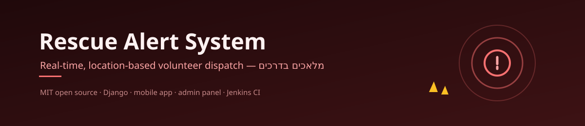

<h1>🚑 rescue-alert-system</h1>

A real-time, location-based volunteer alert system for emergency response.
Built as an <strong>MIT open-source project</strong> for Malachim Badrachim (מלאכים בדרכים), a volunteer initiative focused on helping people in urgent situations on the road and beyond.

<strong>Anyone is welcome to clone, use, fork, or adapt this project</strong> to build their own rescue alert system.

<strong>Project story:</strong> <a href="https://simonhost.navonsimon.com/blog/building-rescue-alert-system">Architecture and product case study</a> ·
<strong>More work:</strong> <a href="https://simonhost.navonsimon.com/work">16 production projects</a>

<h2>🚨 Overview</h2>

When an incident occurs, the system identifies nearby available volunteers and alerts them in real time so they can respond quickly and efficiently.

<h2>⚙️ Core Features</h2>

<ul>
  <li>Volunteer registration and availability status</li>
  <li>Real-time or recent location tracking</li>
  <li>Incident creation by dispatcher/admin</li>
  <li>Radius-based volunteer matching</li>
  <li>Push notifications to nearby responders</li>
  <li>Accept / decline response flow</li>
  <li>Responder tracking and coordination</li>
</ul>

<h2>🧠 How It Works</h2>

<ol>
  <li>A dispatcher creates an alert with a location</li>
  <li>The system finds nearby available volunteers</li>
  <li>Notifications are sent in real time</li>
  <li>Volunteers can accept or decline the alert</li>
  <li>Responders are tracked and coordinated by the system</li>
</ol>

<h2>🛠 Tech Stack</h2>

<ul>
  <li><strong>Backend:</strong> Django + Django REST Framework</li>
  <li><strong>Database:</strong> PostgreSQL + PostGIS</li>
  <li><strong>Admin Panel:</strong> React 19 + TypeScript + Vite (web dispatcher dashboard)</li>
  <li><strong>Mobile App:</strong> Flutter</li>
  <li><strong>Notifications:</strong> Firebase Cloud Messaging (FCM)</li>
  <li><strong>Infrastructure:</strong> Docker + Docker Compose</li>
</ul>

<h2>🚀 Getting Started</h2>

The project is containerized with Docker to make local setup simpler and more consistent across development environments.

<h3>Prerequisites</h3>
<ul>
  <li>Git</li>
  <li>Docker</li>
  <li>Docker Compose</li>
</ul>

<h3>Local Setup</h3>

<pre>
git clone https://github.com/ShimonNavon/rescue-alert-system.git
cd rescue-alert-system
cp .env.example .env
docker compose --profile dev up --build
</pre>

The <code>dev</code> profile adds the Vite dev server for the admin panel. Without it (<code>docker compose up --build</code>) only the backend and database start — which is how production runs, since nginx serves the built panel there.

<h3>Run Migrations</h3>

The container entrypoint already runs <code>migrate</code> and <code>collectstatic</code> on every start. To run them by hand:

<pre>
docker compose exec backend python manage.py migrate
</pre>

<h3>Service URLs</h3>

<ul>
  <li><strong>Backend API:</strong> <code>http://127.0.0.1:8004</code> (gunicorn on port 8000 inside the container)</li>
  <li><strong>Admin Panel:</strong> <code>http://localhost:5173</code> (<code>dev</code> profile only)</li>
  <li><strong>API docs:</strong> <code>http://127.0.0.1:8004/api/docs/</code></li>
</ul>

<h2>🖥 Admin Panel</h2>

The <code>admin-panel/</code> folder contains a React + TypeScript web dashboard for dispatchers and operators. It connects to the same Django API and provides views for managing alerts, monitoring volunteer locations on a map, group messaging, and push-to-talk.

<h3>Run standalone</h3>

<pre>
cd admin-panel
npm install
cp .env.example .env
npm run dev
</pre>

Available at <code>http://localhost:5173</code>. See <a href="admin-panel/README.md">admin-panel/README.md</a> for full documentation.

<h3>Run with Docker Compose</h3>

The admin panel lives behind the <code>dev</code> profile: <code>docker compose --profile dev up --build</code>.

<h2>🚢 Production Deployment</h2>

The stack runs on <code>debian01</code> under <code>/srv/rescue-alert-system</code>. Host nginx (port 80, TLS terminated at Cloudflare) proxies <code>/api/</code> and <code>/admin/</code> to <code>127.0.0.1:8004</code> and serves the built admin panel from <code>admin-panel/dist</code>.

<pre>
git pull
docker compose up -d --build            # backend + db only, no dev profile
docker compose run --rm --no-deps admin-panel \
    sh -c "npm ci && npm run build"     # refresh admin-panel/dist for nginx
</pre>

<strong>The admin panel build is not automatic.</strong> <code>dist/</code> is gitignored, so a <code>git pull</code> alone leaves nginx serving the previous build — rebuild it whenever <code>admin-panel/</code> changes.

<h3>Required nginx location</h3>

The server block needs a <code>/static/</code> location, otherwise Django admin and DRF static files fall through to the SPA's <code>try_files … /index.html</code> and the admin renders unstyled:

<pre>
location /static/ {
    proxy_pass http://127.0.0.1:8004;
    include /etc/nginx/snippets/proxy.conf;
}
</pre>

HTTPS enforcement (<code>SECURE_SSL_REDIRECT</code>, HSTS) stays off until the shared <code>proxy.conf</code> snippet stops overwriting Cloudflare's <code>X-Forwarded-Proto</code> — see the comment in <code>backend/config/settings.py</code>.

<h2>🤝 Contributing</h2>

Contributions are welcome. If you want to improve the system, fix bugs, add features, or adapt it for your own organization, feel free to open an issue or submit a pull request.

There is also a WhatsApp group for active developers who want to help build the project.

<h2>📚 Documentation</h2>

For deeper technical and project documentation, see the project Wiki.

<h2>📄 License</h2>

This project is licensed under the MIT License.

<!-- test webhook -->
